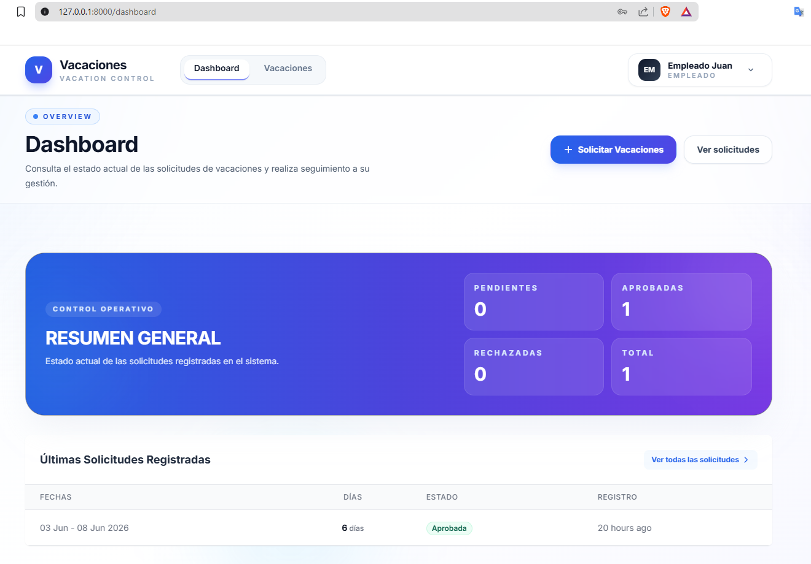
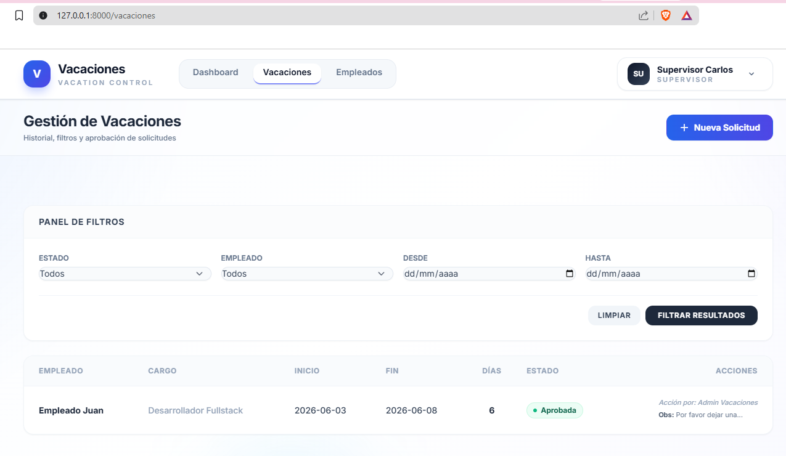
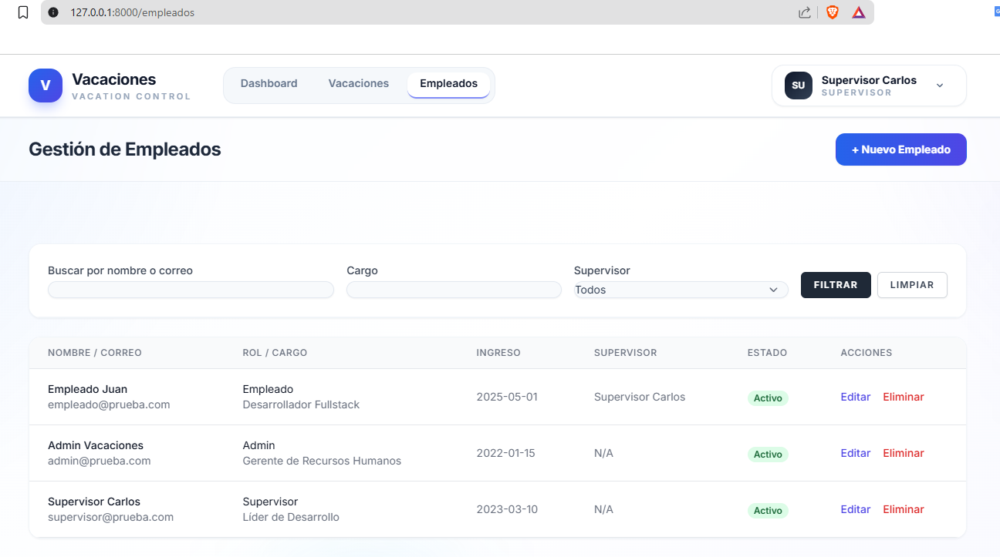

# Sistema de Gestión de Solicitudes de Vacaciones

Prueba técnica desarrollada con **Laravel + Blade tradicional** para administrar solicitudes de vacaciones con autenticación, roles, dashboard, vistas por perfil y un flujo completo de aprobación.


## Stack Utilizado

* Laravel
* Blade tradicional
* Tailwind CSS
* Alpine.js
* MySQL o SQLite

## Alcance Implementado

### Autenticación

* Login con roles y permisos.
* Roles disponibles: Administrador, Supervisor y Empleado.

### Módulo de Empleados

* Listar empleados.
* Crear empleado.
* Editar empleado.
* Eliminar empleado.
* Asignar supervisor.
* Buscar por nombre o correo.
* Filtrar por cargo o supervisor.

### Módulo de Solicitudes de Vacaciones

* Crear solicitud de vacaciones.
* Cálculo automático de días.
* Validación de fechas pasadas.
* Validación de fecha fin mayor o igual a la fecha inicio.
* Validación de motivo obligatorio.
* Cancelación de solicitudes pendientes.

### Vista de Supervisor

* Ve las solicitudes de sus empleados.
* Aprueba o rechaza solicitudes.
* Agrega observaciones al aprobar o rechazar.

### Vista de Administrador

* Ve todas las solicitudes.
* Filtra por estado, empleado y fechas.
* Aprueba o rechaza cualquier solicitud.
* Visualiza historial de acciones y observaciones.

### Vista de Empleado

* Ve todas sus solicitudes.
* Crea nuevas solicitudes.
* Cancela solicitudes sin responder.
* Consulta estado, detalle y observaciones.

### Dashboard

* Total empleados.
* Solicitudes pendientes.
* Solicitudes aprobadas.
* Solicitudes rechazadas.
* Total solicitudes.
* Últimas solicitudes registradas.

## Requisitos Previos

* PHP 8.2 o superior
* Composer
* Node.js y NPM
* Base de datos SQLite o MySQL

## Instrucciones de Instalación

```bash
git clone <https://github.com/Melina3m/SolicitudesVacaciones.git>
cd SolicitudesVacaciones
composer install
npm install && npm run build
cp .env.example .env
php artisan key:generate
php artisan migrate:fresh --seed
php artisan serve
```


## Usuarios de Prueba

La base de datos incluye usuarios precargados para probar todos los roles.

| Rol | Correo | Contraseña |
| :--- | :--- | :--- |
| Administrador | admin@prueba.com | password0828 |
| Supervisor | supervisor@prueba.com | password0828 |
| Empleado | empleado@prueba.com | password0828 |

## Decisiones Técnicas

* Rutas agrupadas y protegidas por middleware.
* Separación clara entre dashboard, empleados y vacaciones.
* Formularios con validaciones y mensajes orientados al usuario.
* Interfaz personalizada con más jerarquía visual, colores con significado y mejor contraste.
* Uso de Alpine.js para interacciones ligeras como modales.

## Capturas de Pantalla

### Dashboard




### Vacaciones



### Empleados


